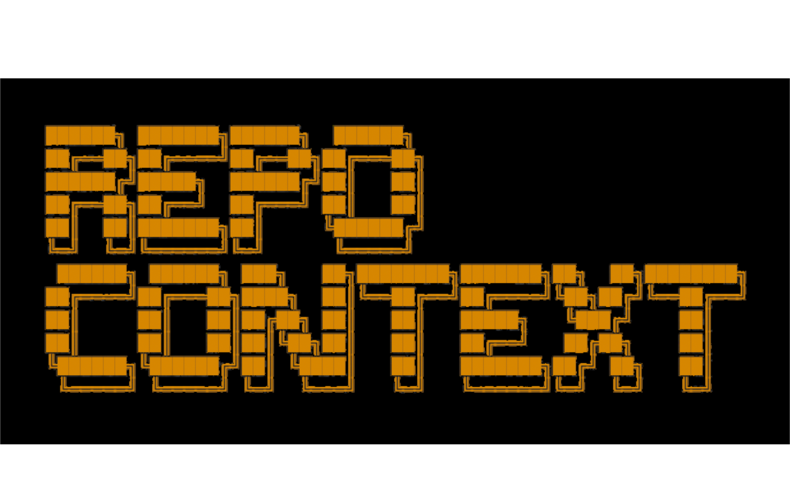
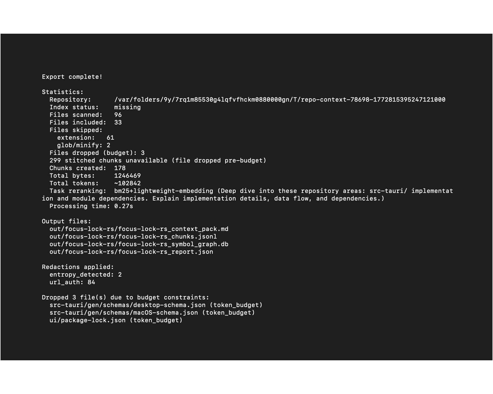
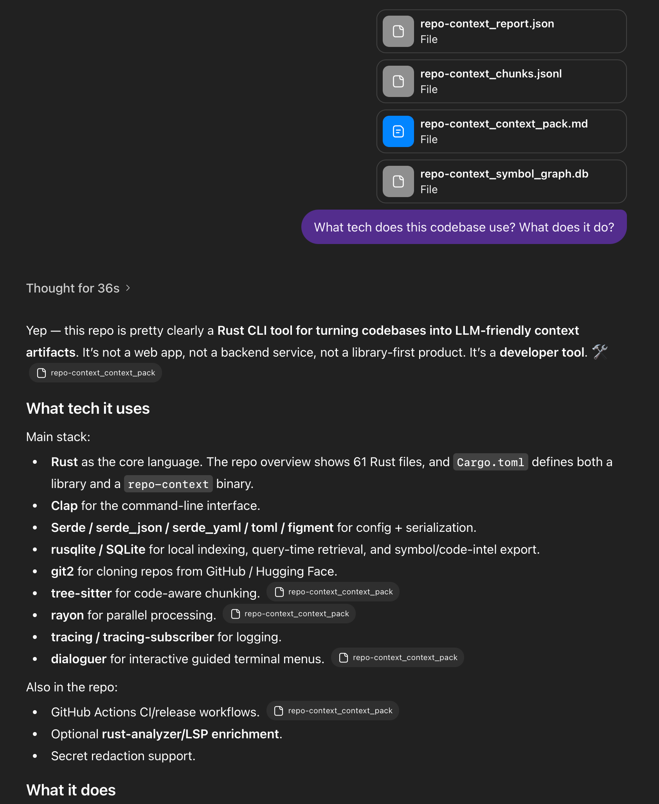
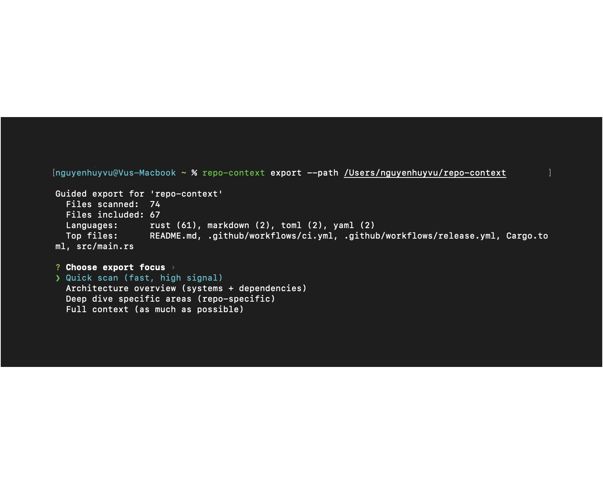

# repo-context
[](https://github.com/wheevu/repo-context/actions/workflows/ci.yml)

<p align="center">
  
</p>

<p align="center">
Turn a code repository into a tidy <b>context pack</b> for LLMs — or feed into a RAG pipeline.
</p>

<p align="center">
  
  <br>
  <em>(0.27s for 100k tokens baby! 🏃🏻⚡️🦀)</em>
</p>

## What it does

Scans a repository and exports **high-signal text bundles**:

- **`context_pack.md`** — structured markdown for ChatGPT/Claude/etc.
- **`chunks.jsonl`** — one chunk per line (for embeddings + retrieval)
- **`report.json`** — stats + what got included/skipped
- **`symbol_graph.db`** — SQLite symbol graph for local analysis

Prioritizes important files (READMEs, configs, entrypoints) over generated code, vendor folders, and binaries.

- **Focused context** — don't dump your entire codebase into chat  
- **Repeatable** — stable ordering + deterministic chunk IDs  
- **Safe** — optional secret redaction with multiple safety modes  

## Demo

<p align="center">
  
</p>

## Features

**Core Export**
- File ranking (docs > configs > entrypoints > tests > generated)
- Language-aware chunking (splits at functions/classes when possible)
- Respects `.gitignore` by default
- Remote repo cloning (GitHub / HuggingFace)

**Advanced Retrieval**
- Task-aware ranking (`--task`) with BM25 + optional semantic rerank
- Thread stitching: reserves token budget for related definitions/importers
- Always-include paths/globs that survive token budgets

**Local Index Workflow**
- `index` — build SQLite index with FTS + symbol tables
- `query` — task-driven chunk retrieval with LSP enrichment
- `codeintel` — export portable SCIP-like JSON

**Contribution & PR Mode**
- `--mode pr-context` — Touch Points, Entrypoints, and Invariants analysis
- Invariant discovery with configurable keywords
- Strict budget handling for protected pins

**Safety**
- Secret redaction: `fast`, `standard`, `paranoid`, or `structure-safe` modes
- Reproducible outputs (`--no-timestamp`)

## Install

### Pre-built binaries

Grab the latest release from [GitHub Releases](https://github.com/wheevu/repo-context/releases) and add to your `PATH`.

### Build from source

```bash
git clone https://github.com/wheevu/repo-context.git
cd repo-context
cargo build --release
# Binary: target/release/repo-context

# Or install to ~/.cargo/bin:
cargo install --path .
```

## Quick start

**Export local repo:**
```bash
repo-context export --path .
```

**Export remote repo:**
```bash
repo-context export --repo https://github.com/owner/repo
```

**Show repo stats only:**
```bash
repo-context info .
```

## Guided mode

`repo-context export` is interactive by default in terminals:

<p align="center">

<p>
  
Choose from:
- **Quick scan** — fast, high-signal defaults
- **Architecture overview** — stronger dependency/system context
- **Deep dive** — repo-specific focus selection
- **Full context** — largest practical bundle

In non-interactive sessions (CI/pipes), it automatically falls back to quick defaults. Skip explicitly with `--quick`.

## Use cases

**Quick export (non-interactive)**
```bash
repo-context export -p . --quick \
  --include-ext ".rs,.toml,.md" \
  --exclude-glob "tests/**,target/**"
```

**Architecture understanding**
```bash
repo-context export -p . --task "overall architecture" --mode both
```

**RAG-only output**
```bash
repo-context export -p . --mode rag -o ./embeddings
```

**Index-based workflow (best quality)**
```bash
repo-context index -p .
repo-context export -p . --task "trace auth flow" --from-index
repo-context query --task "where are retries handled?" --expand
```

**Always-include critical files**
```bash
repo-context export -p . \
  --always-include-path "src/critical.rs,config/core.toml" \
  --always-include-glob "**/important/**" \
  --max-tokens 50000
```

**PR/Contribution context**
```bash
repo-context export -p . --mode pr-context --task "review auth changes"
```

**Compare exports**
```bash
repo-context diff out/v1 out/v2 --format markdown
```

## Commands

```
repo-context [OPTIONS] <COMMAND>

Commands:
  export     Export repository as LLM-friendly context pack
  info       Show repository statistics
  index      Build local SQLite index
  query      Retrieve task-relevant chunks from index
  codeintel  Export portable code-intel JSON (SCIP-lite)
  diff       Compare two export outputs

Options:
  -v, --verbose  Enable DEBUG logging
  -h, --help     Print help
  -V, --version  Print version
```

Run `repo-context <command> --help` for full option listings.

### Common `export` options

| Option | Description |
|--------|-------------|
| `-p, --path <PATH>` | Local repository path |
| `-r, --repo <URL>` | Remote URL (GitHub/HuggingFace) |
| `--ref <REF>` | Branch/tag/SHA for `--repo` |
| `-i, --include-ext <EXTS>` | Extension allowlist (`.rs,.toml`) |
| `-e, --exclude-glob <GLOBS>` | Exclude patterns |
| `-t, --max-tokens <N>` | Token budget cap |
| `--allow-over-budget` | Allow always-include files to exceed budget |
| `--strict-budget` | Hard error if always-include exceeds budget |
| `--always-include-path <PATHS>` | Paths to always include (survive budget) |
| `--always-include-glob <GLOBS>` | Globs to always include (survive budget) |
| `--task <TEXT>` | Task query for ranking |
| `--no-semantic-rerank` | Disable semantic rerank stage |
| `--from-index` | Use local index dataset instead of rescanning |
| `--require-fresh-index` | Require fresh index with `--from-index` |
| `-m, --mode <MODE>` | `prompt`, `rag`, `both`, `contribution`, `pr-context` |
| `--no-timestamp` | Reproducible output (no timestamps) |
| `--quick` | Skip guided menu, use defaults |
| `--no-redact` | Disable secret redaction |
| `--redaction-mode <MODE>` | `fast`, `standard`, `paranoid`, `structure-safe` |

### `index` options

| Option | Description |
|--------|-------------|
| `-p, --path <PATH>` | Local path to index |
| `-r, --repo <URL>` | Remote URL to clone |
| `--db <FILE>` | Output path (default: `.repo-context/index.sqlite`) |
| `--lsp` | Enrich with rust-analyzer symbol references |

### `query` options

| Option | Description |
|--------|-------------|
| `--db <FILE>` | Index database path |
| `--task <TEXT>` | Retrieval query (required) |
| `-n, --limit <N>` | Max results (default: 20) |
| `--lsp-backend <MODE>` | `off`, `auto`, `rust-analyzer` |
| `--expand` | Expand into definitions/callers/tests/docs |

### `codeintel` options

| Option | Description |
|--------|-------------|
| `--db <FILE>` | Index database (default: `.repo-context/index.sqlite`) |
| `--out <FILE>` | Output JSON (default: `.repo-context/codeintel.json`) |

## Output

Files written to `<output-dir>/<repo-name>/`:

- `<repo>_context_pack.md` — overview, tree, key files, chunked content
- `<repo>_chunks.jsonl` — JSON lines with metadata
- `<repo>_report.json` — scan stats, config, skip reasons
- `<repo>_symbol_graph.db` — SQLite symbol graph (unless `--no-graph`)

## Configuration

Auto-discovers config files in repo root:
- `repo-context.toml`, `.repo-context.toml`
- `r2p.toml`, `.r2p.toml`
- `r2p.yml`/`.yaml`, `.r2p.yml`/`.yaml`

CLI flags override config values.

<details>
<summary>Example config (<code>r2p.toml</code>)</summary>

```toml
[repo-context]
include_extensions = [".rs", ".toml", ".md"]
exclude_globs      = ["tests/**", "target/**"]
chunk_tokens       = 800
chunk_overlap      = 120
min_chunk_tokens   = 200
output_dir         = "./out"
mode               = "both"
tree_depth         = 4
respect_gitignore  = true
redact_secrets     = true
```
</details>

## Secret redaction

Enabled by default. Detects and replaces common secrets with placeholders like `[AWS_ACCESS_KEY_REDACTED]`.

**Modes:**
- `fast` — minimal safety checks
- `standard` — balanced (default)
- `paranoid` — aggressive, more false positives
- `structure-safe` — AST-validated for Python

Allowlist paths/strings and add custom patterns via config file.

## Development

```bash
cargo test
cargo fmt
cargo clippy --all-targets --all-features
cargo build --release
```
